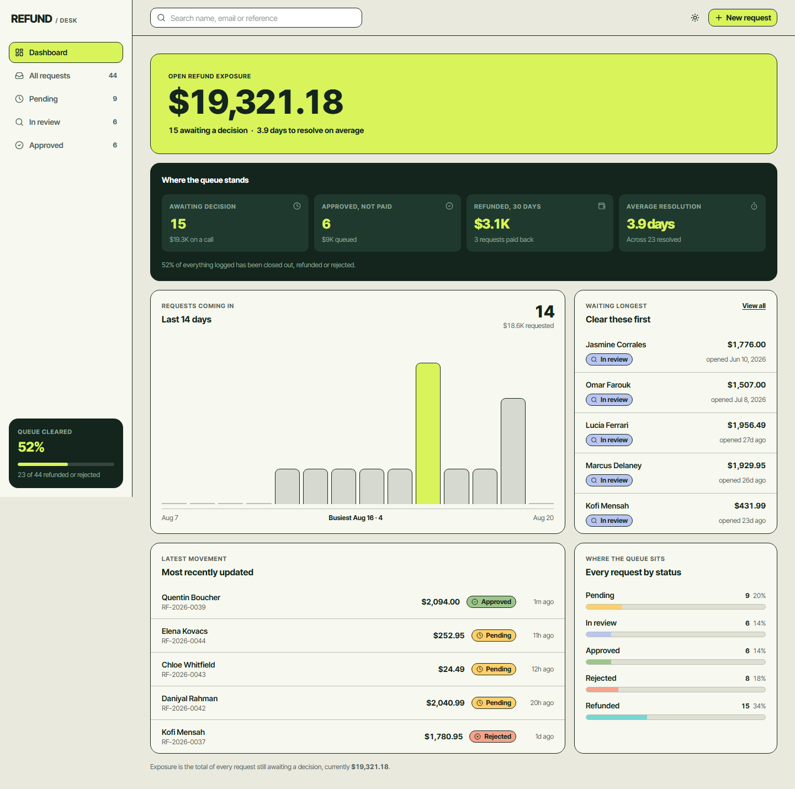
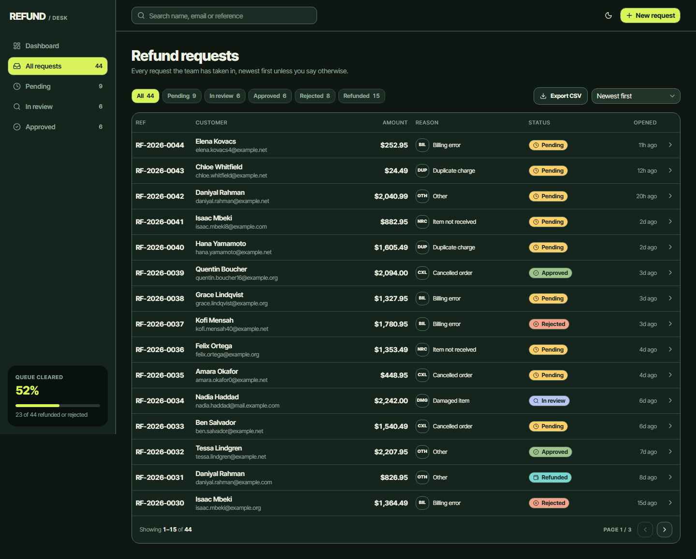
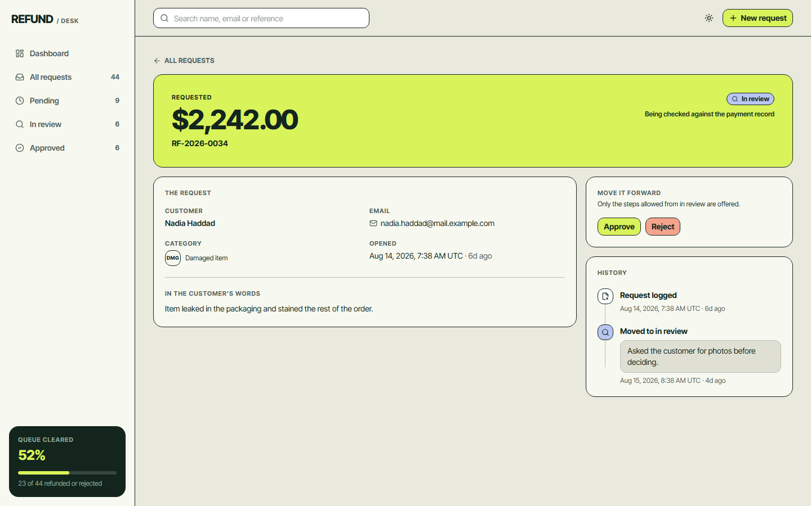
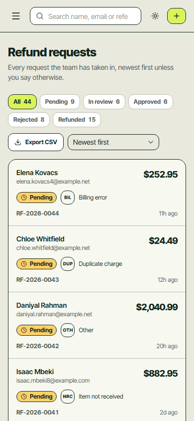

# Refund Desk

An internal tool for a support team to manage customer refund requests. A request is logged
with the customer's name and email, the amount, and why they want their money back. From
there the team filters the queue, reviews each one, and moves it through a status workflow
that keeps a permanent record of every decision.

Built to run on a clean machine with no services, no accounts and no configuration:
install, migrate, seed, go.



---

## Contents

- [What it does](#what-it-does)
- [Screens](#screens)
- [The status workflow](#the-status-workflow)
- [Quick start](#quick-start)
- [Scripts](#scripts)
- [Database and migrations](#database-and-migrations)
- [Testing](#testing)
- [Project structure](#project-structure)
- [Deployment](#deployment)
- [Design](#design)
- [Architecture decisions](#architecture-decisions)
- [Notes on the build](#notes-on-the-build)

---

## What it does

The four things the tool exists for:

| | |
| --- | --- |
| **Create a refund request** | A dialog from the header on any screen. Customer name, email, amount, reason category and a description. Validated in the browser and again on the server. |
| **View all refund requests** | A paginated list, 15 to a page, as a table on desktop and a card list on a phone. |
| **Filter by status** | Filter tabs with live counts, plus search by name, email or reference, and five sort orders. The filter lives in the URL, so any view of the queue is a link you can paste into chat. |
| **Update the status** | Only the moves that are legal from the current status are offered, and every change is recorded with its timestamp and an optional note. |

Everything around those, so it survives real use:

- A dashboard with open exposure, the queue by status, 14-day intake, and the five requests
  that have been waiting longest
- A per-request audit timeline, written in the same transaction as the status change
- CSV export of whatever the current filter is showing, safe against spreadsheet formula
  injection
- Light and dark themes, following the operating system with a header toggle
- Designed empty states, including a different one for "nothing logged yet" and "your filter
  matched nothing"
- Full keyboard reachability and a verified 4.5:1 contrast floor in both themes

## Screens

| Route | What it shows |
| --- | --- |
| `/` | The queue at a glance: open exposure, what is awaiting a decision, what is approved but unpaid, what has been refunded in the last 30 days, average time to resolve, daily intake, oldest waiting, latest movement |
| `/refunds` | The full list, with filters, search, sorting, pagination and CSV export |
| `/refunds/[id]` | One request in full, the moves legal from where it stands, and the history of every change with its note |







## The status workflow

```
pending ──→ in_review ──→ approved ──→ refunded
   │            │
   └───→ rejected ←┘
```

`rejected` and `refunded` are terminal.

The rules live in one place, [`lib/status.ts`](lib/status.ts), and are used three ways:

1. The detail page renders only transitions that are legal from the current status, so the
   UI can never offer a dead end.
2. The Server Action re-checks the same map before writing. A request posted directly — and
   Server Actions are reachable by direct POST — cannot skip review or reopen a closed
   request.
3. The unit tests walk all 25 status pairs and confirm only the five legal ones pass.

**Rejecting requires a note.** Approving and refunding accept one. Every change writes a row
to `refund_status_events` in the same transaction as the status update, so the history can
never disagree with the request.

## Quick start

**You need:** Node 20.12 or newer (`.nvmrc` pins 22) and npm. That is all — no Docker, no
Postgres, no cloud account, no API keys.

```bash
git clone https://github.com/davncntcode/refund-desk.git
cd refund-desk

npm install
npm run db:migrate     # creates data/refunds.db and applies drizzle/
npm run db:seed        # optional: 44 demo requests across every status
npm run dev            # http://localhost:3000
```

**No environment file is needed for local work.** `DATABASE_URL` falls back to
`file:./data/refunds.db` in both the app and the migration config. Copy `.env.example` to
`.env.local` only when you want to point somewhere else, such as a shared Turso database.

The seed is deterministic, so the dashboard and the list look the same on every machine, and
it clears both tables first — safe to re-run whenever you want a clean slate.

### Worth clicking first

1. **The theme toggle**, top right. It follows your OS, so it may already have opened dark.
2. **New request** — submit it empty to see the field errors, then try `12.345` in the amount
   to watch it refuse a fraction of a cent.
3. Open a **pending** request, then *Start review*, then *Approve*. The buttons change to
   only what is legal from the new status, and each note lands in the timeline.
4. Open an **in review** one and try to *Reject* with an empty note. It will not let you.
5. Filter to a status, then **Export CSV** — the download respects the filter you are looking
   at.
6. Drag the window under about 768px. The table becomes a card list and the sidebar moves
   behind a menu button.

## Scripts

| Command | What it does |
| --- | --- |
| `npm run dev` | Dev server on port 3000 |
| `npm run build` | Production build |
| `npm start` | Serve the production build |
| `npm run lint` | ESLint |
| `npm run typecheck` | Regenerate route types, then `tsc --noEmit` |
| `npm test` | Unit tests (vitest) |
| `npm run test:watch` | Unit tests in watch mode |
| `npm run e2e` | End-to-end tests (Playwright) |
| `npm run db:generate` | Generate a migration from the schema |
| `npm run db:migrate` | Apply pending migrations to `DATABASE_URL` |
| `npm run db:seed` | Reset and load the demo data |
| `npm run db:studio` | Browse the database in drizzle studio |
| `npm run notes:pdf` | Rebuild `public/refund-desk-notes.pdf` from `docs/notes.html` |

## Database and migrations

The data layer is **Drizzle ORM over libSQL** — a local SQLite file in development, and the
same code against Turso in production by changing one environment variable.

Two tables, defined in [`lib/db/schema.ts`](lib/db/schema.ts):

**`refund_requests`** — `id`, `reference` (`RF-2026-0001`, the handle the team says out loud),
`customer_name`, `customer_email`, `amount_cents`, `currency`, `reason_category`, `reason`,
`status`, `created_at`, `updated_at`.

**`refund_status_events`** — `id`, `refund_id`, `from_status` (null for the creation row),
`to_status`, `note`, `created_at`.

Migrations are committed SQL in [`drizzle/`](drizzle), generated by drizzle-kit and
**forward-only**. Applied migrations are tracked in a `__drizzle_migrations` table, so
`npm run db:migrate` runs only what is pending and is safe to re-run.

### Changing the schema

```bash
# 1. edit lib/db/schema.ts — the only source of truth
npm run db:generate     # 2. writes a new numbered file into drizzle/
# 3. read the generated SQL before trusting it
npm run db:migrate      # 4. apply it
```

SQLite cannot drop or retype a column in place, so drizzle-kit may emit a full table
rebuild. Read it and check it preserves the data you care about. Commit the migration
together with the schema change.

Never hand-edit a file in `drizzle/`, and never change one that has already been applied
anywhere else — add a new migration instead.

### How the target is chosen

`drizzle.config.ts` resolves in this order: an explicit `DATABASE_URL` in the environment,
then `.env.local`, then the local file default. It also picks its own driver — the `sqlite`
dialect for a local file, and `turso` as soon as `DATABASE_AUTH_TOKEN` is present.

## Testing

```bash
npm test                          # 63 unit tests
npx playwright install chromium   # once, before the first e2e run
npm run e2e                       # 3 end-to-end tests
```

**Unit tests** cover the places where a bug would be silent: every legal and illegal status
transition, the note-required-on-reject rule, amount validation (zero, negative, three
decimals, over the cap), email normalisation, CSV escaping of a comma, a quote, a newline and
a leading `=`, cents-to-dollars round trips, and search-param parsing.

**End-to-end tests** run against a real production build pointed at its own database
(`data/e2e.db`), wiped and migrated before the server starts, so they never touch your
working data. They do the brief end to end: log a request, find it by filter and by search,
walk it to refunded, confirm a rejection without a reason is refused, and check the CSV
export respects the active filter.

## Project structure

```
app/
  (app)/                    the shell: sidebar, topbar, dynamic rendering
    page.tsx                dashboard
    refunds/                list and detail
  actions/refunds.ts        createRefund, updateRefundStatus
  api/refunds/export/       csv of the current filtered view
  globals.css               the whole token layer
  icon.svg                  favicon
lib/
  domain.ts                 status and category tuples, dependency-free leaf module
  status.ts                 transition map, note rules, status presentation
  reasons.ts                reason category labels and codes
  refund-filters.ts         search param parsing and url building
  format.ts                 money, dates, durations, amount parsing
  csv.ts                    rfc 4180 escaping
  db/                       schema, client, queries, seed
  validation/refund.ts      zod schemas, shared by form and action
components/
  ui/                       shadcn primitives
  shell/                    sidebar, topbar, search, theme toggle
  refunds/                  table, card list, chips, dialogs, timeline
  dashboard/                exposure band, signal panel, chart, lists
drizzle/                    generated migrations, forward only
e2e/                        playwright specs
docs/                       design brief, design system, screenshots
```

Every read lives in `lib/db/queries.ts` and every write in `app/actions/refunds.ts`. Those
are the two files to open when you need to know how data moves.

## Deployment

### Vercel

Supported, with one requirement: **the default SQLite file cannot be used there.** A
serverless filesystem is read-only and separate per invocation, so the database has to be
remote. Turso speaks libSQL, so no application code changes — only the two variables.

1. Create a Turso database, in the same region as your Vercel functions, and copy its URL
   and auth token.
2. Apply the migrations once, from your machine or from CI:

   ```bash
   DATABASE_URL=libsql://your-database.turso.io \
   DATABASE_AUTH_TOKEN=your-token \
   npm run db:migrate
   ```

   Seed it the same way if you want the demo rows.
3. Import the repo on Vercel and set `DATABASE_URL` and `DATABASE_AUTH_TOKEN` in the project
   environment.
4. Deploy.

No `vercel.json`, no adapter, no change to the output mode. `engines.node` pins the runtime.

Two things that make this safe rather than lucky:

- **The build never touches the database.** Every route is server-rendered on demand, so
  nothing is prerendered that needs data and a build cannot fail on a database problem.
- **A missing `DATABASE_URL` fails loudly.** In production the app refuses to fall back to
  the local file default, so you get a clear message instead of an obscure read-only
  filesystem error on the first request.

**Migrations do not run on deploy, on purpose.** Run `npm run db:migrate` against the
production URL yourself, or from CI, before shipping a schema change.

`@libsql/client` carries a native module for local file access. Vercel installs it without
trouble — the linux-x64 prebuilds are in the lockfile — but a remote-only deployment that
would rather not ship it can import `@libsql/client/web` in `lib/db/index.ts` instead.

### A server or a container

Keep the SQLite file. Set `DATABASE_URL` explicitly — production requires it — and mount
`data/` on a persistent volume so it survives a redeploy. Everything else is
`npm run build && npm start`.

## Design

The interface follows a defined visual direction rather than framework defaults: a paper
canvas, 1px ink hairlines instead of shadows, one acid lime used only where the eye should
land, inverted ink panels for the figures that matter, and a single typeface carrying the
hierarchy through weight and size.

- [`docs/DESIGN-BRIEF.md`](docs/DESIGN-BRIEF.md) — the brief, the values measured off the
  reference, and what was adapted rather than copied
- [`docs/DESIGN-SYSTEM.md`](docs/DESIGN-SYSTEM.md) — tokens, type scale, components,
  accessibility floor

Colours, type and spacing all come from the token layer in `app/globals.css`. No component
contains a hex literal.

## Architecture decisions

**Next.js App Router with Server Actions, no API layer.** There are two writes in the whole
application. A REST or tRPC layer would be indirection with nothing in it.

**libSQL rather than Postgres.** One environment variable is the difference between a local
file and a hosted database, so a clean checkout runs with nothing to install and the same
code deploys for a team. The schema is plain Drizzle, so moving to Postgres later is a
dialect change rather than a rewrite.

**No client state library.** Filter, search, sort and page live in the URL and are read on
the server. No Redux, no Zustand, no TanStack Query.

**Integer cents everywhere.** Money is `amount_cents` in SQLite and an integer in TypeScript.
No float ever touches an amount. Formatting happens in exactly one place,
[`lib/format.ts`](lib/format.ts).

**Timestamps are UTC**, stored as epoch milliseconds and rendered UTC with the zone labelled.

## Notes on the build

The same notes are downloadable as a four-page PDF from the bottom of the sidebar in the
running app, or directly at [`/refund-desk-notes.pdf`](public/refund-desk-notes.pdf). It is
generated from [`docs/notes.html`](docs/notes.html) with `npm run notes:pdf`, styled from the
same tokens as the interface — so edit the HTML and regenerate rather than editing the PDF.

### Assumptions

- **It sits behind something.** Scoped as an internal tool on a network or SSO that already
  authenticates the team, so it has no login of its own. That one assumption drives the
  biggest limitation below.
- **The brief named a status field but not the statuses.** The five-state machine, and the
  rule that a rejection needs a reason, are my design. A team may want different states, so
  they live in one file.
- **One currency, one timezone** — USD and UTC.
- **Reason is a category plus a description.** The brief asked for "reason"; a free-text box
  alone cannot be filtered or reported on, so a request carries both.
- **Hundreds to thousands of requests, not millions.** Offset pagination, a 5,000-row export
  cap and `max(reference) + 1` are all comfortable at that size and would not be at ten
  million.
- **The amount is what the customer asked for**, not what was eventually paid.
- **Whoever runs this next has no cloud accounts**, so the default database is a local file.

### Improvements beyond the brief

- The status workflow is **enforced in the Server Action**, not only in the UI, so a direct
  POST cannot skip review or reopen a closed request
- An **audit timeline** per request, written in the same transaction as the status change
- A **dashboard** — open exposure, queue standing, 14-day intake, oldest waiting
- **Search, five sort orders and pagination**, all in the URL so any view is shareable
- **CSV export** of the active filter, hardened against spreadsheet formula injection
- **Human references** (`RF-2026-0001`) rather than exposing ids
- **Light and dark themes**, designed empty states, and a card list rather than a sideways
  scrolling table on phones
- **66 tests** — 63 unit, 3 end-to-end against a real build on its own database
- A **deterministic seed**, so every machine shows the same 44 requests
- Contrast **verified by computation** in both themes rather than by eye
- Money as **integer cents** end to end, formatted in exactly one place

### Known limitations

- **No authentication, so no actor on the audit trail.** Changes record what and when, not
  who. Server Actions are reachable by direct POST and carry no authorisation check today.
- **libSQL/SQLite takes one writer at a time.** Fine for a support team, not for high write
  concurrency. Reference generation (`max + 1` inside a transaction) would need a real
  sequence under heavy concurrent creates.
- **Offset pagination** slows down deep into a very large table, and **export is synchronous**
  and capped at 5,000 rows.
- **Average resolution** is `updated_at − created_at`, which would skew if a row could be
  edited after it was resolved. Today it cannot.
- No partial refunds, no currency beyond USD, no attachments, no customer notifications.
- No rate limiting, and no CI pipeline.
- Accessibility was verified by computation and code review — contrast, focus rings, labels,
  semantics — but **not with an actual screen reader**.
- `npm audit` reports four moderate advisories, all one development-only esbuild issue reached
  through drizzle-kit. It affects the esbuild dev server rather than this application, and the
  offered fix is a four-year-old drizzle-kit. Left alone on purpose.
- No `LICENSE` file yet, so default copyright applies.

### What I would do next

1. **Authentication with agent and manager roles**, and an actor on every status event. It
   closes the one real security gap and unblocks everything else here.
2. **CI on every pull request** — lint, typecheck, unit and e2e — plus a deploy preview.
3. **Tell the customer.** The tool records what the team decided; the email is still a human
   step.
4. **Connect the money.** "Refunded" is a status, not a payment. Wiring it to the payment
   provider makes the record true rather than asserted.
5. **Ageing and SLA alerts** on the pending queue, since "waiting longest" is the screen a
   team would live in.
6. **Bulk actions** on the list, plus keyset pagination and a streamed export if volume grows.
7. A **screen reader pass**, to confirm what the computed checks only imply.
